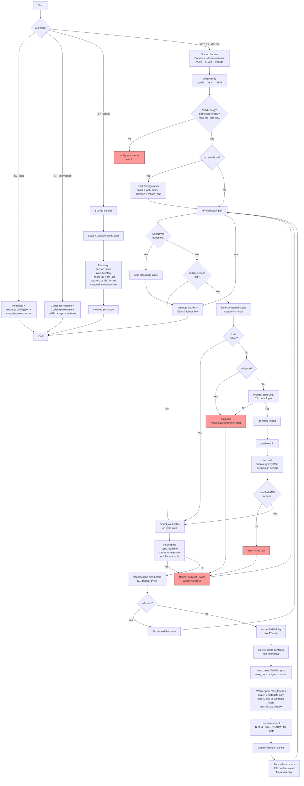

# warm-drive-cache

> External configuration via `config.json` (paths, walk depth/size gates/threads, ignore names).
> See the "Configuration via `config.json`" section below.

Rust utility for maintenance of rclone FUSE mount cache directories. Part of the [xSAR](https://xSAR.com.au) toolkit.

**Critical distinction (safety):**
- "sync" (exposed) directories: the paths rclone mounts (e.g. /home/user/mounts/myproject). The tool ONLY traverses these and warms the VFS: **File contents read** when file size is inside the configured window, otherwise **attributes/metadata only**. **NEVER delete from sync directories** — they contain your live data.
- "cache" directory: the separate directory given to rclone via `--cache-dir` (e.g. ~/.rclone_cache). The tool calculates on-disk size (before/after) and performs complete deletion of contents here only, to clear stale cached data.

The cache dir is often shared across multiple sync dirs. See your rclone systemd units for the exact `--cache-dir` value.

## Configuration
The tool loads a `config.json` file containing an array of path pairs. Each pair has:
- `sync`: the rclone-exposed directory to traverse and warm (size-gated **File contents read** or metadata only; concurrent workers).
- `cache`: the rclone cache directory for size checks and deletion.
- `service` (optional): systemd unit that mounts `sync` (system or user; name must match the real unit).

With **`-v` / `--verbose`**, the full **Configuration** block and **Pre-flight checks** detail are printed. Without verbose, those sections are suppressed (failures, start prompts, and the warm path summary still appear).

### Size display format

All human-readable sizes use one shared formatter (IEC binary units):

| Range | Example |
|-------|---------|
| `< 1024` | `482 Bytes` |
| `< 1 MiB` | `64KiB (65536 Bytes)` |
| `< 1 GiB` | `2.60MiB (2724922 Bytes)` |
| larger | `GiB` / `TiB` / `PiB` the same way |

Whole multiples omit decimals (`1MiB (1048576 Bytes)`); other values use two decimal places. Config fields such as `walk.max_file_size_bytes` use the same formatter when shown on screen (special values `-1` / `0` are described in words — see `walk` table below).

### Size *input* in `config.json`

`min_file_size_bytes` and `max_file_size_bytes` accept either:

| Form | Examples | Meaning |
|------|----------|---------|
| JSON number (whole bytes) | `65536`, `0`, `-1` | Exact byte count (`-1` only on max) |
| JSON string, no unit | `"65536"`, `"-1"` | Same as number |
| JSON string with unit | `"64KiB"`, `"64K"`, `"64kb"`, `"1MiB"`, `"1M"`, `"512B"` | Coefficient × unit |

**Units (case-insensitive, binary powers of 1024):**

| Suffix | Multiplier |
|--------|------------|
| *(none)* / `B` / `b` | 1 (bytes; `B` and `b` are treated the same) |
| `K` / `KB` / `KiB` | 1024 (`K` alone is allowed — omit the `B`) |
| `M` / `MB` / `MiB` | 1024² |
| `G` / `GB` / `GiB` | 1024³ |
| `T` / `TB` / `TiB` | 1024⁴ |
| `P` / `PB` / `PiB` | 1024⁵ |

Fractional coefficients are allowed **with a unit** (e.g. `"1.5KiB"` → 1536 bytes). A bare JSON float such as `12.5` (no unit) is a configuration error. Optional spaces: `"64 KiB"`.

## Reporting
The application reports the on-disk size of the **cache** directory before and after refresh using the formatter above. End-of-pair counters include **File contents read** and **Metadata-only** (not “1-byte reads”). The live status block shows a summary line (`dirs` / `files` / `thr active/max` / errors) plus **one line per worker** (`N of M`, compact size, `READ` or `ATTR`, path shortened by stripping the sync root / `$HOME` then truncated to 80 characters). Graceful stop: **Ctrl+C** or **q** (TTY) finishes in-flight workers and does not start new files.

## Cache Maintenance
The tool performs a complete deletion of all files and subdirectories **in the cache directory only** (never the sync/exposed dirs) to prevent stale data accumulation. Deletion is **non-interactive** (no confirmation prompt). Use `--dry-run` to preview what would be deleted.

## Documentation & Secrets Policy
An example config.json is provided. The README.md, all source comments, and the example file contain no concrete local paths, usernames, or sensitive values. All references use generic placeholders (e.g. rclone://example-remote/example/path or /path/to/cache). Paths are classified as secrets.

## CLI options

| Option | Description |
|--------|-------------|
| `-h`, `--help` | Brief usage, where `config.json` must live, embedded `config.example.json`, `max_file_size_bytes` specials, link to README |
| `-i`, `--information` | Product information only: `Codebase Version`, `Codebase release` date, AGPL-3.0-only, repo + https://xSAR.com.au (exits) |
| `-c`, `--check` | Validate config layout; for each entry print **service name**, **sync directory**, **`--cache-dir` from the unit** (preferred), **current cache size**, and **systemd active/inactive (system or user)** |
| `-v`, `--verbose` | On a normal run: print **Configuration** and full **Pre-flight checks** detail. Quiet is the default. |
| `-l`, `--log` | Write a time-stamped CSV under `/tmp/warm-drive-cache-YYYYMMDD-HHMMSS.csv` with columns **Service name**, **path**, **filename**, **size (bytes)**, **status** (`READ` or `ATTRIB`). Path is printed again after a blank line at program end. |
| `--dry-run` | Simulate cache deletion only (no warm). May be combined with `-v` / `-l`. |

**Precedence when several flags are present:** `-h` → `-i` → `-c` → normal run (with optional `-v` / `--dry-run`).

Normal runs always print the startup identity banner (product of xSAR, licence, website, source). Use `-i` for the short product-information dump without loading config.

### Typical invocations

```bash
# Product information (no config load)
warm-drive-cache -i

# Validate layout + service/cache report
warm-drive-cache -c

# Quiet maintenance run (default)
warm-drive-cache

# Verbose: Configuration + Pre-flight detail
warm-drive-cache -v

# Preview deletions only
warm-drive-cache --dry-run
warm-drive-cache -v --dry-run
```

## Program Flow



**Flow (narrative):** optional CLI exit (`help` / `information` / `check`) → otherwise banner → load and validate config (including `max_file_size_bytes` specials) → optional **verbose Configuration** dump → for each path pair: **systemd** (detect scope; if inactive and user agrees: `daemon-reload` → `enable` → `start`, with **sudo** retry for system units; require **enabled + active**) **before** **mount settle**, then permission probes → report cache size → wipe **cache** (unless `--dry-run`) → parallel warm of **sync** (**File contents read** vs metadata per size policy) → summary. Ctrl+C / `q` finishes in-flight work only.

## Configuration via `config.json`

The tool is configured **exclusively** via a JSON file. There are no hardcoded paths or settings in the source.

### Location (in priority order)

1. **`config.json` next to the executable** (same directory as the binary). Preferred for desktop/systemd wrappers. **This file is gitignored** when it holds real paths.
2. `WARM_DRIVE_CACHE_CONFIG` environment variable → full path to a `.json` file (CI / alternate profiles).
3. XDG: `$XDG_CONFIG_HOME/warm-drive-cache/config.json` or `~/.config/warm-drive-cache/config.json`.

**Tracked vs local**

| File | Git | Purpose |
|------|-----|---------|
| `config.example.json` | tracked | Public template with **placeholders only** (no real users/paths) |
| `config.json` | **untracked** | Your live machine paths + real systemd unit names |
| `live.json` | **untracked** | Optional local alternate profile |

Copy: `cp config.example.json config.json` (or next to `target/release/` after build) and edit.

### Missing config behaviour

If no file is found, the loader returns empty `paths` and the program exits with instructions to create the file. The tool is useless without at least one path pair.

### Layout overview

```text
{
  "version": 1,                 // optional schema version
  "paths": [ ... ],             // required: one object per mount/cache pair
  "walk": { ... },              // optional walk / warm controls
  "ignore": { "names": [...] }, // optional basename skip list
  "mount_wait": { ... }         // optional FUSE settle timings
}
```

### `paths[]` entries (required array)

Each element describes **one** mount to warm and the cache directory that may be cleared.

| Field | Type | Required | Description |
|-------|------|----------|-------------|
| `sync` | string | **yes** | Absolute path to the **rclone mount** (live data). Traversed and warmed only — **never deleted**. |
| `cache` | string | **yes** | Absolute path to the rclone **`--cache-dir`** used by that mount (or a shared cache). Used for size reports and non-interactive content deletion. |
| `service` | string | no | systemd unit name (system or user), e.g. `gdrive-project-a.service`. Use the **real** unit name (do not invent an `rclone-` prefix). Pre-flight auto-detects scope. |

**Safety rules encoded in the loader**

- `sync` and `cache` must be **absolute** (start with `/`).
- `sync` and `cache` must **not** nest or equal each other (prevents deleting live data).
- `service`, if present, must not contain `/` or control characters.
- At least one path pair is required.
- `walk.max_file_size_bytes` must resolve to **`-1`**, **`0`**, or a **positive** byte count (see special values and size input above).
- Size fields may be numbers or unit strings; unknown units and bare fractional numbers are configuration errors.

### `walk` (optional)

| Field | Type | Default | Description |
|-------|------|---------|-------------|
| `max_depth` | integer or `null` | `null` | `WalkDir` max depth; `null` = unlimited. `0` is rejected. |
| `min_file_size_bytes` | number or size string | `0` | Min size for File contents read when `max_file_size_bytes > 0`; `0` = no lower bound. Accepts bytes or unit strings (see **Size input**). Displayed with the shared IEC formatter. |
| `max_file_size_bytes` | number or size string | `0` | **File contents read** policy (see special values). Accepts bytes or unit strings. |
| `max_threads` | integer | `8` | Concurrent warm workers (`1`–`64`). |

#### `max_file_size_bytes` special values

| Value | Meaning |
|-------|---------|
| **`-1`** | **No** File contents read — metadata/attributes only for every file. |
| **`0`** | File contents read for **all** files, any size (ignores `min_file_size_bytes`). |
| **`N > 0`** | File contents read when file size is in the window `[min_file_size_bytes, N]` (`min` of `0` = no lower bound). Outside window → metadata only. |
| Other negatives | **Configuration error** — program prints a warning/explanation and exits. |
| Non-integer (e.g. `12.5`) | **Configuration error** — invalid JSON for this field; program exits. |

When the limit is a positive `N`, it is displayed like cache sizes, e.g. `64KiB (65536 Bytes)`.

### `ignore` (optional)

| Field | Type | Default | Description |
|-------|------|---------|-------------|
| `names` | string[] | `[]` | Exact basenames to prune (e.g. `.git`, `node_modules`). Matching directories skip their whole subtree. Config roots are never ignored. |

### `mount_wait` (optional)

Runs **after** systemd enable/active verification (when a service is configured) and **before** permission probes and cache wipe. Quiet mode still waits; verbose mode prints settle progress.

| Field | Type | Default | Description |
|-------|------|---------|-------------|
| `initial_secs` | integer | `3` | Wait after path exists before content probe. |
| `retry_delays_secs` | integer[] | `[3, 5, 8]` | Delays while the mount listing looks empty. |
| `max_wait_secs` | integer | `30` | Hard ceiling per path. |

### Pre-flight and systemd (normal run)

For each path pair, in order:

1. If `service` is set: detect **system** vs **user** unit (`LoadState`).
2. If inactive and not `--dry-run`: prompt to start; on yes → `daemon-reload` → `enable` → `start`.
3. Confirm unit is **enabled** and **active** before continuing (settle wait comes next).
4. **System** units: mutating `systemctl` calls retry with **`sudo`** if the unprivileged call fails.
5. `mount_wait` settle on `sync`.
6. Permission probes: sync readable, cache write/read/delete probe, unit file readable (when configured).

Failures skip that pair; other pairs continue.

### Full example (placeholders only)

```json
{
  "version": 1,
  "paths": [
    {
      "sync": "/home/user/mounts/project-a",
      "cache": "/home/user/.rclone_cache",
      "service": "gdrive-project-a.service"
    },
    {
      "sync": "/home/user/mounts/project-b",
      "cache": "/home/user/.rclone_cache",
      "service": "gdrive-project-b.service"
    }
  ],
  "walk": {
    "max_depth": null,
    "min_file_size_bytes": 0,
    "max_file_size_bytes": "64KiB",
    "max_threads": 8
  },
  "ignore": {
    "names": [".git", ".svn", "node_modules", "target", "__pycache__"]
  },
  "mount_wait": {
    "initial_secs": 3,
    "retry_delays_secs": [3, 5, 8],
    "max_wait_secs": 30
  }
}
```

In this example `"max_file_size_bytes": "64KiB"` (also valid: `65536`, `"64K"`, `"64KB"`) means File contents read for files up to **64KiB (65536 Bytes)**; larger files get metadata only. Use `0` for all sizes, or `-1` for metadata-only.

### `-c` / `--check` report fields

For each `paths[]` entry the check mode prints a spaced group:

1. **Service name** — `paths[].service` (or note if omitted)
2. **File directory** — `paths[].sync` (mount target) + exists/dir status
3. **Cache path** — prefers **`--cache-dir` parsed from the unit** (`systemctl cat` or `systemctl --user cat`, auto-detected); falls back to `paths[].cache` with a note if the flag is missing or differs
4. **Current cache size** — recursive on-disk size in IEC form (`NKiB (… Bytes)`, etc.)
5. **systemd** — active / inactive when a unit name is set (**system** or **user** scope auto-detected)

### Important rules (summary)

- Prefer absolute paths only; relative paths are rejected.
- Never delete under `sync`; only warm.
- Delete only under `cache` (non-interactive; use `--dry-run` to preview).
- Keep `config.example.json` free of real usernames and host paths when publishing.
- Omitted sections or fields fall back to the values shown in the table above.
- When the file is completely missing, the program still uses the defaults for `walk`, `ignore`, and `mount_wait`, but `paths` becomes empty and triggers a helpful startup error.

**Safety**: The tool will refuse overlapping sync/cache paths. Always double-check your rclone service `--cache-dir` vs mount points.

See also the ready-to-copy example at `config.example.json` in the repository root.

### Creating the file
The build process copies `config.example.json` into the release directory (e.g. `target/release/config.example.json`).

```bash
# After `cargo build --release`
cp target/release/config.example.json target/release/config.json
# edit target/release/config.json with your {"sync": "...", "cache": "..."} pairs
```

Alternatively for XDG:
```bash
mkdir -p ~/.config/warm-drive-cache
cp config.example.json ~/.config/warm-drive-cache/config.json
```

## Requirements

- Rust stable (2024 edition)
- rclone remote(s) configured (sync/cache path pairs provided via config.json; see your rclone --cache-dir)
- Linux (uses standard `std::fs`; developed on Arch)

## Build & run

```bash
cargo build --release
./target/release/warm-drive-cache -i          # product information
./target/release/warm-drive-cache -c          # config / service check
./target/release/warm-drive-cache             # quiet maintenance run
./target/release/warm-drive-cache -v          # verbose Configuration + Pre-flight
./target/release/warm-drive-cache --dry-run   # simulate cache wipe only
```

Optional install to a directory on your `PATH` (e.g. `~/.local/bin`):

```bash
cp target/release/warm-drive-cache ~/.local/bin/
# place config.json next to the binary, or use WARM_DRIVE_CACHE_CONFIG / XDG
```

Debug build:

```bash
cargo run -- -c
cargo run -- -v --dry-run
```

## Testing

```bash
cargo test
cargo test -- --quiet
cargo test format_bytes          # size formatter
cargo test should_read_file      # File contents read policy
cargo test parse_cli             # CLI flags
```

Unit tests cover the pure helpers and core logic using synthetic `tempfile` trees only. Production paths are never exercised by tests (paths are loaded from config.json and treated as secrets).

## Example output

Quiet dry-run sketch (placeholders only):

```
Rust utility for removing rclone cache staleness and warming mounts.
Quit gracefully: Ctrl+C (SIGINT) or press q (TTY) — finishes in-flight workers, starts no new work.

┌─────────────────────────────────────────────────────────────────┐
│  warm-drive-cache                                               │
│  Codebase Version: 0.1.0                                        │
│  Codebase release: 18th July, 2026                              │
│  Website: https://xSAR.com.au                                   │
│  Licence: AGPL-3.0-only (see LICENSE file)                      │
│  Homepage: https://xSAR.com.au                                  │
│  Source:  https://github.com/xSAR-research/warm-drive-cache     │
└─────────────────────────────────────────────────────────────────┘

📂 Sync dir (traverse/warm only): /home/user/mounts/project-a
   Cache dir (size/delete only): /home/user/.rclone_cache
   systemd unit: gdrive-project-a.service
   Before size (cache): 12.34MiB (12939427 Bytes)
   --dry-run enabled: simulating full deletion (no changes made)
   After size (simulated, cache): 0 Bytes

✅ Cache maintenance complete!
```

After a live warm, counters look like:

```
   Size after warming (cache): 2.60MiB (2724922 Bytes)
   Directories processed: …
   Files processed: …
   File contents read: …
   Metadata-only: …
   Errors: 0
```

## Deployment tip

Run periodically via a **systemd timer** after rclone mounts come up at login or boot to keep caches fresh (use --dry-run first).

## Sample systemd Unit (user or system)

This tool is designed to work with rclone VFS mounts managed by systemd.

Set `paths[].service` to the **exact** unit name (for example `gdrive-myproject.service` — do **not** invent an `rclone-` prefix unless that is how the unit is actually installed). At runtime the tool auto-detects:

| Scope | Typical location | Commands used |
|-------|------------------|---------------|
| **system** | `/etc/systemd/system/` | `systemctl …` (retries with `sudo` on permission errors) |
| **user** | `~/.config/systemd/user/` | `systemctl --user …` |

If the user agrees to start a stopped unit, the program runs **`daemon-reload` → `enable` → `start`**, then requires **enabled** and **active** **before** `mount_wait` settle.

The following is a **sample** of a systemd **user unit** (with personal secrets stripped). System units under `/etc/systemd/system/` with `User=` also work — put the real unit name in config.

### Important notes
- The mount point directory **must** be created in advance and must be writable/accessible by your user:
  ```bash
  mkdir -p ~/mounts/myproject
  ```
- Your rclone remote (here called `myremote`) must already be configured.
- Match `paths[].cache` to the unit’s `--cache-dir`.

### Where to install the unit file
User units belong in your user's systemd configuration directory:

```
~/.config/systemd/user/gdrive-myproject.service
```

System units (example path):

```
/etc/systemd/system/gdrive-myproject.service
```

### Commands to enable and start the service

**User unit:**

```bash
# 1. Place the unit file in ~/.config/systemd/user/
# 2. Reload, enable, and start
systemctl --user daemon-reload
systemctl --user enable --now gdrive-myproject.service

systemctl --user status gdrive-myproject.service
journalctl --user -u gdrive-myproject.service -f
```

**System unit** (often needs root / sudo):

```bash
sudo systemctl daemon-reload
sudo systemctl enable --now gdrive-myproject.service
systemctl status gdrive-myproject.service
journalctl -u gdrive-myproject.service -f
```

### Sample unit file (`gdrive-myproject.service`)

```ini
[Unit]
Description=rclone VFS mount for MyProject
After=network-online.target
Wants=network-online.target

[Service]
Type=notify
ExecStartPre=/bin/mkdir -p %h/mounts/myproject
ExecStart=/usr/bin/rclone mount myremote: %h/mounts/myproject \
    --config=%h/.config/rclone/rclone.conf \
    --vfs-cache-mode full \
    --cache-dir=%h/.rclone_cache \
    --dir-cache-time 5m \
    --poll-interval 1m \
    --vfs-read-chunk-size 64M \
    --log-level INFO

ExecStop=/bin/fusermount -u %h/mounts/myproject

Restart=on-failure
RestartSec=10

[Install]
WantedBy=default.target
```

**Notes on the sample:**
- Uses systemd specifiers like `%h` (expands to the user's home directory) so the unit is easy to reuse.
- The `--cache-dir` points to the rclone cache directory used by the mount (see your `config.json` for the exact value used by `warm-drive-cache`).
- A similar unit can be created for another remote (e.g. `gdrive-archive.service` pointing at the `archive` remote and its mount/cache paths).
- You can create a systemd user timer (or use `warm-drive-cache` directly via a timer) that starts after these mounts are active.

## More from xSAR

For more tools, guides, and projects, visit [xSAR](https://xSAR.com.au).

## Licence

This project is licensed under the [GNU Affero General Public License v3.0 only](LICENSE) (AGPL-3.0-only). See the `LICENSE` file for the full text.