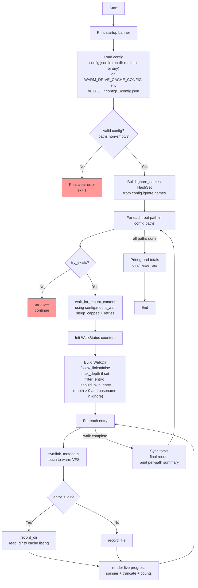

# warm-drive-cache

> External configuration via `config.json` (supports paths, `max_depth`, and ignore names such as `.git`).
> See the "Configuration via `config.json`" section below.

Rust utility for maintenance of rclone FUSE mount cache directories. Part of the [xSAR](https://xSAR.com.au) toolkit.

**Critical distinction (safety):**
- "sync" (exposed) directories: the paths rclone mounts (e.g. /home/user/mounts/myproject). The tool ONLY traverses these and reads 1 byte from each file to warm/update metadata in the cache. **NEVER delete from sync directories** — they contain your live data.
- "cache" directory: the separate directory given to rclone via `--cache-dir` (e.g. ~/.rclone_cache). The tool calculates on-disk size (before/after) and performs complete deletion of contents here only, to clear stale cached data.

The cache dir is often shared across multiple sync dirs. See your rclone systemd units for the exact `--cache-dir` value.

## Configuration
The tool loads a config.json file containing an array of path pairs. Each pair has:
- `sync`: the rclone-exposed directory to traverse and warm (read 1 byte/file).
- `cache`: the rclone cache directory for size checks and deletion.

## Reporting
The application calculates and reports the on-disk size (in bytes, shown as MiB when large) of the **cache** directory immediately before and after the refresh operation. It also reports oldest/newest file dates for the cache.

## Cache Maintenance
The tool performs a complete deletion of all files and subdirectories **in the cache directory only** (never the sync/exposed dirs) to prevent stale data accumulation. Use --dry-run to preview; user approval is required for actual deletion.

## Documentation & Secrets Policy
An example config.json is provided. The README.md, all source comments, and the example file contain no concrete local paths, usernames, or sensitive values. All references use generic placeholders (e.g. rclone://example-remote/example/path or /path/to/cache). Paths are classified as secrets.

## Program Flow



The diagram shows the high-level flow from startup through config-driven path processing, mount settling, controlled walking (with max_depth and ignore.names — note root protection + subtree pruning via should_skip_entry), metadata touching for VFS warming, and live + final reporting. The ignore HashSet is prepared once before processing paths.

## Configuration via `config.json`

The tool is configured **exclusively** via a JSON file. There are no hardcoded paths or settings in the source.

### Location (in priority order)

1. `config.json` in the run directory (the directory containing the executable binary). This allows bundling the config next to the binary in release directories.
2. `WARM_DRIVE_CACHE_CONFIG` environment variable (must point to a full path to a `.json` file). Useful for testing, CI, or running with different configurations.
3. `$XDG_CONFIG_HOME/warm-drive-cache/config.json`  
   Falls back to `~/.config/warm-drive-cache/config.json` on typical Linux setups (including Arch).

### Missing config file behaviour

If no config file exists at the chosen location:
- The loader returns a default `Config` (with the classic timing values below).
- `paths` will be empty.
- `main()` will then print a clear error and exit, instructing you to create the file.

This is intentional — the tool is useless without at least one path.

### Full Schema

All top-level fields except `paths` are optional and have sensible defaults that match the original hardcoded behaviour.

| Field                        | Type                    | Required | Default          | Description |
|-----------------------------|-------------------------|----------|------------------|-------------|
| `version`                   | integer                 | no       | `1`              | Config schema version. Reserved for future breaking changes. |
| `paths`                     | array of objects        | **yes**  | —                | Array of pairs. Each: `{"sync": "/path/to/exposed/rclone/dir", "cache": "/path/to/rclone/cache"}`. "sync" dirs are only traversed/warmed; "cache" is for size/delete. Cache can be shared. |
| `walk.max_depth`            | integer or `null`       | no       | `null` (unlimited) | Maximum directory depth for `WalkDir`. `null` or omitted = no limit. |
| `ignore.names`              | array of string         | no       | `[]`             | Basenames (files or directories) to skip during the walk. Matching directories cause their entire subtree to be pruned. Matching is exact on the basename (case-sensitive) and applies at any depth. The root of any configured path is **never** ignored. |
| `mount_wait.initial_secs`   | integer                 | no       | `3`              | Seconds to wait after confirming the path exists before checking for content. |
| `mount_wait.retry_delays_secs` | array of integer     | no       | `[3, 5, 8]`      | List of retry delays (in seconds) used while the directory still appears empty. |
| `mount_wait.max_wait_secs`  | integer                 | no       | `30`             | Hard ceiling on total waiting time per path. |

### Minimal working example
```json
{
  "paths": [
    {"sync": "rclone://example-remote/example/path1", "cache": "/path/to/rclone/cache"},
    {"sync": "rclone://example-remote/example/path2", "cache": "/path/to/rclone/cache"}
  ]
}
```

### Full example
```json
{
  "version": 1,
  "paths": [
    {"sync": "/home/user/mounts/project-a", "cache": "/home/user/.rclone_cache"},
    {"sync": "/home/user/mounts/project-b", "cache": "/home/user/.rclone_cache"}
  ],
  "walk": {
    "max_depth": 5
  },
  "ignore": {
    "names": [".git", ".svn", "node_modules", "target", "__pycache__"]
  },
  "mount_wait": {
    "initial_secs": 3,
    "retry_delays_secs": [3, 5, 8],
    "max_wait_secs": 30
  }
}
```

### Important rules & validation

- Each entry must have both `sync` and `cache` as **absolute** paths (start with `/`). Relative paths are rejected.
- `paths` must not be empty.
- `sync` dirs are **never** deleted from (they are your live rclone-exposed data). Only traversed + 1 byte read per file.
- `cache` dirs receive the size calculations and full content deletion.
- `walk.max_depth` of `0` is rejected (it would only visit the root itself).
- Omitted sections or fields fall back to the values shown in the table above.
- When the file is completely missing, the program still uses the defaults for `walk`, `ignore`, and `mount_wait`, but `paths` becomes empty and triggers a helpful startup error.

**Safety**: The tool will refuse overlapping sync/cache paths. Always double-check your rclone service `--cache-dir` vs mount points.

See also the ready-to-copy example at `config.example.json` in the repository root.

### Creating the file
The build process copies `config.example.json` into the release directory (e.g. `target/release/config.example.json`).

```bash
# After `cargo build --release`
cp target/release/config.example.json target/release/config.json
# edit target/release/config.json with your {"sync": "...", "cache": "..."} pairs
```

Alternatively for XDG:
```bash
mkdir -p ~/.config/warm-drive-cache
cp config.example.json ~/.config/warm-drive-cache/config.json
```

## Requirements

- Rust stable (2024 edition)
- rclone remote(s) configured (sync/cache path pairs provided via config.json; see your rclone --cache-dir)
- Linux (uses standard `std::fs`; developed on Arch)

## Build & run

```bash
cargo build --release
./target/release/warm-drive-cache
```

Debug build:

```bash
cargo run
```

## Testing

```bash
cargo test
cargo test -- --quiet
cargo test truncate_display   # narrow filter
```

Unit tests cover the pure helpers and core logic using synthetic `tempfile` trees only. Production paths are never exercised by tests (paths are loaded from config.json and treated as secrets).

## Example output

```
🚀 warm-drive-cache: Rust utility for removing cache staleness and warming.
   Licenced under MIT by xSAR. For more tools visit https://xSAR.com.au or our repo at https://github.com/xSAR-research/warm-drive-cache

📂 Sync dir (traverse/warm only): rclone://example-remote/example/path1
   Cache dir (size/delete only): /path/to/rclone/cache
   Before size (cache): 12.34 MiB (...)
   --dry-run enabled: simulating full deletion (no changes made)
   ...
   After size (simulated, cache): 0 bytes

✅ Cache maintenance complete!
   (Because the storage is write-through, no separate cache-clear step is required or executed.)
```

## Deployment tip

Run periodically via a **systemd timer** after rclone mounts come up at login or boot to keep caches fresh (use --dry-run first).

## Sample systemd User Unit

This tool is designed to work with rclone VFS mounts managed by systemd.

The following is a **sample** of a systemd **user unit** (with all personal secrets, usernames, and specific paths stripped). It is **not** a system unit installed under `/etc/systemd/system/`. Because the services run as your regular user account, these are **user units**.

### Important notes
- The mount point directory **must** be created in advance and must be writable/accessible by your user:
  ```bash
  mkdir -p ~/mounts/myproject
  ```
- Your rclone remote (here called `myremote`) must already be configured.

### Where to install the unit file
User units belong in your user's systemd configuration directory:

```
~/.config/systemd/user/gdrive-myproject.service
```

### Commands to enable and start the service
```bash
# 1. Place the unit file in the location shown above
# 2. Reload user units and enable + start the service
systemctl --user daemon-reload
systemctl --user enable --now gdrive-myproject.service

# Check that it is running
systemctl --user status gdrive-myproject.service

# View logs
journalctl --user -u gdrive-myproject.service -f
```

### Sample unit file (`gdrive-myproject.service`)

```ini
[Unit]
Description=rclone VFS mount for MyProject
After=network-online.target
Wants=network-online.target

[Service]
Type=notify
ExecStartPre=/bin/mkdir -p %h/mounts/myproject
ExecStart=/usr/bin/rclone mount myremote: %h/mounts/myproject \
    --config=%h/.config/rclone/rclone.conf \
    --vfs-cache-mode full \
    --cache-dir=%h/.rclone_cache \
    --dir-cache-time 5m \
    --poll-interval 1m \
    --vfs-read-chunk-size 64M \
    --log-level INFO

ExecStop=/bin/fusermount -u %h/mounts/myproject

Restart=on-failure
RestartSec=10

[Install]
WantedBy=default.target
```

**Notes on the sample:**
- Uses systemd specifiers like `%h` (expands to the user's home directory) so the unit is easy to reuse.
- The `--cache-dir` points to the rclone cache directory used by the mount (see your `config.json` for the exact value used by `warm-drive-cache`).
- A similar unit can be created for another remote (e.g. `gdrive-archive.service` pointing at the `archive` remote and its mount/cache paths).
- You can create a systemd user timer (or use `warm-drive-cache` directly via a timer) that starts after these mounts are active.

## More from xSAR

For more tools, guides, and projects, visit [xSAR](https://xSAR.com.au).

## Licence

This project is licensed under the [MIT License](LICENSE). See the `LICENSE` file for full details.