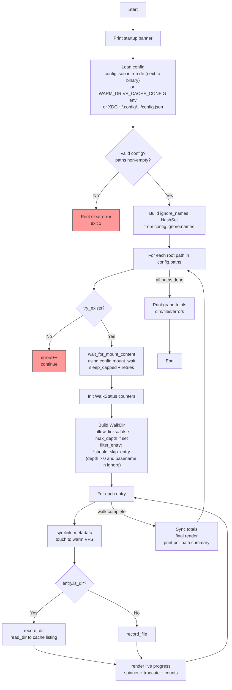

# warm-drive-cache

> External configuration via `config.json` (supports paths, `max_depth`, and ignore names such as `.git`).
> See the "Configuration via `config.json`" section below.

Rust utility for maintenance of rclone FUSE mount cache directories. It loads configured rclone remote paths, reports on-disk sizes, and performs complete deletion of cache directory contents to prevent stale data accumulation. Because the storage is write-through, no separate cache-clear step is required or executed.

## Configuration
The tool loads a config.json file containing an array of rclone remote paths to be refreshed.

## Reporting
The application calculates and reports the on-disk size (in bytes) of the cache directory immediately before and after the refresh operation.

## Cache Maintenance
The tool performs a complete deletion of all files and subdirectories in the cache directory to prevent stale data accumulation. Use --dry-run to preview; user approval is required for actual deletion.

## Documentation & Secrets Policy
An example config.json is provided. The README.md, all source comments, and the example file contain no concrete local paths, usernames, or sensitive values. All references use generic placeholders (e.g. rclone://example-remote/example/path). Paths are classified as secrets.

## Program Flow



The diagram shows the high-level flow from startup through config-driven path processing, mount settling, controlled walking (with max_depth and ignore.names — note root protection + subtree pruning via should_skip_entry), metadata touching for VFS warming, and live + final reporting. The ignore HashSet is prepared once before processing paths.

## Configuration via `config.json`

The tool is configured **exclusively** via a JSON file. There are no hardcoded paths or settings in the source.

### Location (in priority order)

1. `config.json` in the run directory (the directory containing the executable binary). This allows bundling the config next to the binary in release directories.
2. `WARM_DRIVE_CACHE_CONFIG` environment variable (must point to a full path to a `.json` file). Useful for testing, CI, or running with different configurations.
3. `$XDG_CONFIG_HOME/warm-drive-cache/config.json`  
   Falls back to `~/.config/warm-drive-cache/config.json` on typical Linux setups (including Arch).

### Missing config file behaviour

If no config file exists at the chosen location:
- The loader returns a default `Config` (with the classic timing values below).
- `paths` will be empty.
- `main()` will then print a clear error and exit, instructing you to create the file.

This is intentional — the tool is useless without at least one path.

### Full Schema

All top-level fields except `paths` are optional and have sensible defaults that match the original hardcoded behaviour.

| Field                        | Type                    | Required | Default          | Description |
|-----------------------------|-------------------------|----------|------------------|-------------|
| `version`                   | integer                 | no       | `1`              | Config schema version. Reserved for future breaking changes. |
| `paths`                     | array of string         | **yes**  | —                | List of **absolute** root directories to warm. Must contain at least one entry. |
| `walk.max_depth`            | integer or `null`       | no       | `null` (unlimited) | Maximum directory depth for `WalkDir`. `null` or omitted = no limit. |
| `ignore.names`              | array of string         | no       | `[]`             | Basenames (files or directories) to skip during the walk. Matching directories cause their entire subtree to be pruned. Matching is exact on the basename (case-sensitive) and applies at any depth. The root of any configured path is **never** ignored. |
| `mount_wait.initial_secs`   | integer                 | no       | `3`              | Seconds to wait after confirming the path exists before checking for content. |
| `mount_wait.retry_delays_secs` | array of integer     | no       | `[3, 5, 8]`      | List of retry delays (in seconds) used while the directory still appears empty. |
| `mount_wait.max_wait_secs`  | integer                 | no       | `30`             | Hard ceiling on total waiting time per path. |

### Minimal working example
```json
{
  "paths": [
    "rclone://example-remote/example/path1",
    "rclone://example-remote/example/path2"
  ]
}
```

### Full example
```json
{
  "version": 1,
  "paths": [
    "rclone://example-remote/example/path1",
    "rclone://example-remote/example/path2"
  ],
  "walk": {
    "max_depth": 5
  },
  "ignore": {
    "names": [".git", ".svn", "node_modules", "target", "__pycache__"]
  },
  "mount_wait": {
    "initial_secs": 3,
    "retry_delays_secs": [3, 5, 8],
    "max_wait_secs": 30
  }
}
```

### Important rules & validation

- All paths **must** be absolute (start with `/`). Relative paths are rejected.
- `paths` must not be empty.
- `walk.max_depth` of `0` is rejected (it would only visit the root itself).
- Omitted sections or fields fall back to the values shown in the table above.
- When the file is completely missing, the program still uses the defaults for `walk`, `ignore`, and `mount_wait`, but `paths` becomes empty and triggers a helpful startup error.

See also the ready-to-copy example at `config.example.json` in the repository root.

### Creating the file
The build process copies `config.example.json` into the release directory (e.g. `target/release/config.example.json`).

```bash
# After `cargo build --release`
cp target/release/config.example.json target/release/config.json
# edit target/release/config.json with your paths
```

Alternatively for XDG:
```bash
mkdir -p ~/.config/warm-drive-cache
cp config.example.json ~/.config/warm-drive-cache/config.json
```

## Requirements

- Rust stable (2024 edition)
- rclone remote(s) configured (paths provided via config.json)
- Linux (uses standard `std::fs`; developed on Arch)

## Build & run

```bash
cargo build --release
./target/release/warm-drive-cache
```

Debug build:

```bash
cargo run
```

## Testing

```bash
cargo test
cargo test -- --quiet
cargo test truncate_display   # narrow filter
```

Unit tests cover the pure helpers and core logic using synthetic `tempfile` trees only. Production paths are never exercised by tests (paths are loaded from config.json and treated as secrets).

## Example output

```
🚀 warm-drive-cache starting - rclone cache maintenance (refresh via delete)

📂 Cache dir: rclone://example-remote/example/path1
   Before size: 12345678 bytes
   --dry-run enabled: simulating full deletion (no changes made)
   Would delete: ...
   After size (simulated): 0 bytes

✅ Cache maintenance complete!
   (Because the storage is write-through, no separate cache-clear step is required or executed.)
```

## Deployment tip

Run periodically via a **systemd timer** after rclone mounts come up at login or boot to keep caches fresh (use --dry-run first).

## Licence

TBD.