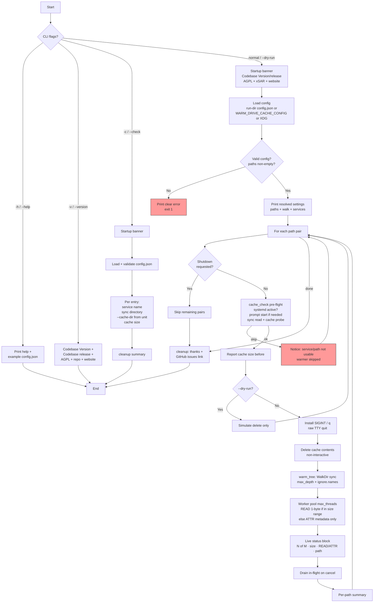

# warm-drive-cache

> External configuration via `config.json` (paths, walk depth/size gates/threads, ignore names).
> See the "Configuration via `config.json`" section below.

Rust utility for maintenance of rclone FUSE mount cache directories. Part of the [xSAR](https://xSAR.com.au) toolkit.

**Critical distinction (safety):**
- "sync" (exposed) directories: the paths rclone mounts (e.g. /home/user/mounts/myproject). The tool ONLY traverses these and warms the VFS: **1-byte read** when file size is inside the configured min/max window, otherwise **attributes/metadata only**. **NEVER delete from sync directories** — they contain your live data.
- "cache" directory: the separate directory given to rclone via `--cache-dir` (e.g. ~/.rclone_cache). The tool calculates on-disk size (before/after) and performs complete deletion of contents here only, to clear stale cached data.

The cache dir is often shared across multiple sync dirs. See your rclone systemd units for the exact `--cache-dir` value.

## Configuration
The tool loads a config.json file containing an array of path pairs. Each pair has:
- `sync`: the rclone-exposed directory to traverse and warm (size-gated 1-byte read or metadata only; concurrent workers).
- `cache`: the rclone cache directory for size checks and deletion.

Resolved walk settings (`min_file_size_bytes`, `max_file_size_bytes`, `max_threads`, etc.) are printed once at program start after the JSON config is loaded.

## Reporting
The application calculates and reports the on-disk size (in bytes, shown as MiB when large) of the **cache** directory immediately before and after the refresh operation. The live status block shows a summary line (`dirs` / `files` / `thr active/max` / errors) plus **one line per worker** (`N of M`, compact size, `READ` or `ATTR`, path shortened by stripping the sync root / `$HOME` then truncated to 80 characters). Graceful stop: **Ctrl+C** or **q** (TTY) finishes in-flight workers and does not start new files.

## Cache Maintenance
The tool performs a complete deletion of all files and subdirectories **in the cache directory only** (never the sync/exposed dirs) to prevent stale data accumulation. Deletion is **non-interactive** (no confirmation prompt). Use `--dry-run` to preview what would be deleted.

## Documentation & Secrets Policy
An example config.json is provided. The README.md, all source comments, and the example file contain no concrete local paths, usernames, or sensitive values. All references use generic placeholders (e.g. rclone://example-remote/example/path or /path/to/cache). Paths are classified as secrets.

## CLI options

| Option | Description |
|--------|-------------|
| `-h`, `--help` | Brief usage, where `config.json` must live, embedded `config.example.json`, link to README |
| `-v`, `--version` | `Codebase Version`, `Codebase release` date, AGPL-3.0-only, repo + https://xSAR.com.au |
| `-c`, `--check` | Validate config layout; for each entry print **service name**, **sync directory**, **`--cache-dir` from the systemd unit** (preferred), and **current cache size** |
| `--dry-run` | Simulate cache deletion only (no warm) |

Startup always prints the same version/release identity block (product of xSAR, licence, website, source).

## Program Flow



Flow: optional CLI exit (`help` / `version` / `check`) → otherwise banner with **Codebase Version** and **Codebase release** → load config → per pair **pre-flight** (systemd + permissions) → wipe **cache** → parallel warm of **sync**. Ctrl+C/`q` finishes in-flight work only.

## Configuration via `config.json`

The tool is configured **exclusively** via a JSON file. There are no hardcoded paths or settings in the source.

### Location (in priority order)

1. **`config.json` next to the executable** (same directory as the binary). Preferred for desktop/systemd wrappers. **This file is gitignored** when it holds real paths.
2. `WARM_DRIVE_CACHE_CONFIG` environment variable → full path to a `.json` file (CI / alternate profiles).
3. XDG: `$XDG_CONFIG_HOME/warm-drive-cache/config.json` or `~/.config/warm-drive-cache/config.json`.

**Tracked vs local**

| File | Git | Purpose |
|------|-----|---------|
| `config.example.json` | tracked | Public template with **placeholders only** (no real users/paths) |
| `config.json` | **untracked** | Your live machine paths + real systemd unit names |
| `live.json` | **untracked** | Optional local alternate profile |

Copy: `cp config.example.json config.json` (or next to `target/release/` after build) and edit.

### Missing config behaviour

If no file is found, the loader returns empty `paths` and the program exits with instructions to create the file. The tool is useless without at least one path pair.

### Layout overview

```text
{
  "version": 1,                 // optional schema version
  "paths": [ ... ],             // required: one object per mount/cache pair
  "walk": { ... },              // optional walk / warm controls
  "ignore": { "names": [...] }, // optional basename skip list
  "mount_wait": { ... }         // optional FUSE settle timings
}
```

### `paths[]` entries (required array)

Each element describes **one** mount to warm and the cache directory that may be cleared.

| Field | Type | Required | Description |
|-------|------|----------|-------------|
| `sync` | string | **yes** | Absolute path to the **rclone mount** (live data). Traversed and warmed only — **never deleted**. |
| `cache` | string | **yes** | Absolute path to the rclone **`--cache-dir`** used by that mount (or a shared cache). Used for size reports and non-interactive content deletion. |
| `service` | string | no | systemd **user** unit name, e.g. `rclone-gdrive-project-a.service`. Used by pre-flight and by `-c`/`--check` to read `--cache-dir` from the unit and report active/inactive. |

**Safety rules encoded in the loader**

- `sync` and `cache` must be **absolute** (start with `/`).
- `sync` and `cache` must **not** nest or equal each other (prevents deleting live data).
- `service`, if present, must not contain `/` or control characters.
- At least one path pair is required.

### `walk` (optional)

| Field | Type | Default | Description |
|-------|------|---------|-------------|
| `max_depth` | integer or `null` | `null` | `WalkDir` max depth; `null` = unlimited. `0` is rejected. |
| `min_file_size_bytes` | integer | `0` | Min size for a 1-byte warm read; `0` = no lower bound. |
| `max_file_size_bytes` | integer | `0` | Max size for a 1-byte warm read; `0` = no upper bound. Outside range → **ATTR** (metadata only). |
| `max_threads` | integer | `8` | Concurrent warm workers (`1`–`64`). |

### `ignore` (optional)

| Field | Type | Default | Description |
|-------|------|---------|-------------|
| `names` | string[] | `[]` | Exact basenames to prune (e.g. `.git`, `node_modules`). Matching directories skip their whole subtree. Config roots are never ignored. |

### `mount_wait` (optional)

| Field | Type | Default | Description |
|-------|------|---------|-------------|
| `initial_secs` | integer | `3` | Wait after path exists before content probe. |
| `retry_delays_secs` | integer[] | `[3, 5, 8]` | Delays while the mount listing looks empty. |
| `max_wait_secs` | integer | `30` | Hard ceiling per path. |

### Full example (placeholders only)

```json
{
  "version": 1,
  "paths": [
    {
      "sync": "/home/user/mounts/project-a",
      "cache": "/home/user/.rclone_cache",
      "service": "rclone-gdrive-project-a.service"
    },
    {
      "sync": "/home/user/mounts/project-b",
      "cache": "/home/user/.rclone_cache",
      "service": "rclone-gdrive-project-b.service"
    }
  ],
  "walk": {
    "max_depth": null,
    "min_file_size_bytes": 0,
    "max_file_size_bytes": 0,
    "max_threads": 8
  },
  "ignore": {
    "names": [".git", ".svn", "node_modules", "target", "__pycache__"]
  },
  "mount_wait": {
    "initial_secs": 3,
    "retry_delays_secs": [3, 5, 8],
    "max_wait_secs": 30
  }
}
```

### `-c` / `--check` report fields

For each `paths[]` entry the check mode prints a spaced group:

1. **Service name** — `paths[].service` (or note if omitted)
2. **File directory** — `paths[].sync` (mount target) + exists/dir status
3. **Cache path** — prefers **`--cache-dir` parsed from the user unit** (`systemctl --user cat`); falls back to `paths[].cache` with a note if the flag is missing or differs
4. **Current cache size** — recursive on-disk size of the effective cache directory
5. **systemd** — active / inactive when a unit name is set

### Important rules (summary)

- Prefer absolute paths only; relative paths are rejected.
- Never delete under `sync`; only warm.
- Delete only under `cache` (non-interactive; use `--dry-run` to preview).
- Keep `config.example.json` free of real usernames and host paths when publishing.
- Omitted sections or fields fall back to the values shown in the table above.
- When the file is completely missing, the program still uses the defaults for `walk`, `ignore`, and `mount_wait`, but `paths` becomes empty and triggers a helpful startup error.

**Safety**: The tool will refuse overlapping sync/cache paths. Always double-check your rclone service `--cache-dir` vs mount points.

See also the ready-to-copy example at `config.example.json` in the repository root.

### Creating the file
The build process copies `config.example.json` into the release directory (e.g. `target/release/config.example.json`).

```bash
# After `cargo build --release`
cp target/release/config.example.json target/release/config.json
# edit target/release/config.json with your {"sync": "...", "cache": "..."} pairs
```

Alternatively for XDG:
```bash
mkdir -p ~/.config/warm-drive-cache
cp config.example.json ~/.config/warm-drive-cache/config.json
```

## Requirements

- Rust stable (2024 edition)
- rclone remote(s) configured (sync/cache path pairs provided via config.json; see your rclone --cache-dir)
- Linux (uses standard `std::fs`; developed on Arch)

## Build & run

```bash
cargo build --release
./target/release/warm-drive-cache
```

Debug build:

```bash
cargo run
```

## Testing

```bash
cargo test
cargo test -- --quiet
cargo test truncate_display   # narrow filter
```

Unit tests cover the pure helpers and core logic using synthetic `tempfile` trees only. Production paths are never exercised by tests (paths are loaded from config.json and treated as secrets).

## Example output

```
┌────────────────────────────────────────────────────────────┐
│  warm-drive-cache v0.1.0
│  A product of xSAR
│  Website: https://xSAR.com.au
│  Licence: AGPL-3.0-only  (full text: LICENSE in the source tree)
│  Homepage: https://xSAR.com.au
│  Source:  https://github.com/xSAR-research/warm-drive-cache
└────────────────────────────────────────────────────────────┘
   Rust utility for removing rclone cache staleness and warming mounts.
   Quit gracefully: Ctrl+C (SIGINT) or press q (TTY) — finishes in-flight workers, starts no new work.

📂 Sync dir (traverse/warm only): rclone://example-remote/example/path1
   Cache dir (size/delete only): /path/to/rclone/cache
   Before size (cache): 12.34 MiB (...)
   --dry-run enabled: simulating full deletion (no changes made)
   ...
   After size (simulated, cache): 0 bytes

✅ Cache maintenance complete!
   (Because the storage is write-through, no separate cache-clear step is required or executed.)
```

## Deployment tip

Run periodically via a **systemd timer** after rclone mounts come up at login or boot to keep caches fresh (use --dry-run first).

## Sample systemd User Unit

This tool is designed to work with rclone VFS mounts managed by systemd.

The following is a **sample** of a systemd **user unit** (with all personal secrets, usernames, and specific paths stripped). It is **not** a system unit installed under `/etc/systemd/system/`. Because the services run as your regular user account, these are **user units**.

### Important notes
- The mount point directory **must** be created in advance and must be writable/accessible by your user:
  ```bash
  mkdir -p ~/mounts/myproject
  ```
- Your rclone remote (here called `myremote`) must already be configured.

### Where to install the unit file
User units belong in your user's systemd configuration directory:

```
~/.config/systemd/user/gdrive-myproject.service
```

### Commands to enable and start the service
```bash
# 1. Place the unit file in the location shown above
# 2. Reload user units and enable + start the service
systemctl --user daemon-reload
systemctl --user enable --now gdrive-myproject.service

# Check that it is running
systemctl --user status gdrive-myproject.service

# View logs
journalctl --user -u gdrive-myproject.service -f
```

### Sample unit file (`gdrive-myproject.service`)

```ini
[Unit]
Description=rclone VFS mount for MyProject
After=network-online.target
Wants=network-online.target

[Service]
Type=notify
ExecStartPre=/bin/mkdir -p %h/mounts/myproject
ExecStart=/usr/bin/rclone mount myremote: %h/mounts/myproject \
    --config=%h/.config/rclone/rclone.conf \
    --vfs-cache-mode full \
    --cache-dir=%h/.rclone_cache \
    --dir-cache-time 5m \
    --poll-interval 1m \
    --vfs-read-chunk-size 64M \
    --log-level INFO

ExecStop=/bin/fusermount -u %h/mounts/myproject

Restart=on-failure
RestartSec=10

[Install]
WantedBy=default.target
```

**Notes on the sample:**
- Uses systemd specifiers like `%h` (expands to the user's home directory) so the unit is easy to reuse.
- The `--cache-dir` points to the rclone cache directory used by the mount (see your `config.json` for the exact value used by `warm-drive-cache`).
- A similar unit can be created for another remote (e.g. `gdrive-archive.service` pointing at the `archive` remote and its mount/cache paths).
- You can create a systemd user timer (or use `warm-drive-cache` directly via a timer) that starts after these mounts are active.

## More from xSAR

For more tools, guides, and projects, visit [xSAR](https://xSAR.com.au).

## Licence

This project is licensed under the [GNU Affero General Public License v3.0 only](LICENSE) (AGPL-3.0-only). See the `LICENSE` file for the full text.